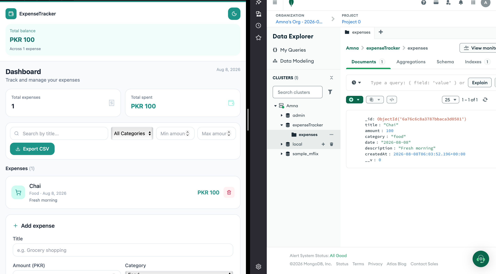

# ExpenseTracker — Backend

A REST API for tracking personal expenses, built with Node.js, Express, and MongoDB (via Mongoose). Built as part of the TechnerLab Bootcamp (MERN Stack + AI Engineering) — Assignment 2.

> **Migration note:** This backend originally used file-based storage (Node's `fs` module) instead of a database. It was later migrated to MongoDB to support proper concurrent writes, querying, and production-grade persistence — without changing the API contract, so the frontend required zero changes.

---

## Table of Contents

- [Overview](#overview)
- [Tech Stack](#tech-stack)
- [Project Structure](#project-structure)
- [Setup & Installation](#setup--installation)
- [Environment Variables](#environment-variables)
- [API Reference](#api-reference)
- [Data Model](#data-model)
- [Middleware](#middleware)
- [Bonus Features](#bonus-features)
- [Deployment](#deployment)
- [Screenshots](#screenshots)
- [Troubleshooting](#troubleshooting)

---

## Overview

This backend exposes a full CRUD REST API for managing expenses. Data is persisted in **MongoDB** using **Mongoose** schemas and models — all database logic lives in `models/Expense.js` and is accessed through the controllers, keeping a clean separation between the data layer and the API layer.

The API follows an MVC-style structure: routes define endpoints, controllers hold the business logic, and custom middleware handles logging, validation, and centralized error handling.

---

## Tech Stack

| Tool | Purpose |
|---|---|
| Node.js | JavaScript runtime |
| Express.js | Routing & middleware |
| MongoDB (Atlas) | Cloud-hosted database |
| Mongoose | Schema modeling & queries for MongoDB |
| `cors` | Allows the frontend (different port/origin) to call this API |
| `dotenv` | Loads `PORT` and `MONGO_URI` from `.env` |
| Nodemon (dev) | Auto-restarts the server on file changes |

---

## Project Structure

```text
expensetracker-backend/
├── server.js                 # Entry point — connects to MongoDB, then starts the server
├── .env                       # PORT + MONGO_URI (not committed)
├── .gitignore
├── package.json
├── config/
│   └── db.js                  # Mongoose connection logic
├── models/
│   └── Expense.js              # Mongoose schema — the single source of truth for expense shape
├── routes/
│   └── expenseRoutes.js        # Defines all /api/expenses endpoints
├── controllers/
│   └── expenseController.js    # Business logic — all MongoDB queries happen here
└── middleware/
    ├── logger.js                # Logs method + URL + timestamp on every request
    ├── validate.js               # Factory middleware — checks required fields exist
    └── errorHandler.js           # 4-param error handler, registered last
```

---

## Setup & Installation

```bash
npm install
```

Create a `.env` file in the project root (see [Environment Variables](#environment-variables)).

Run in development mode (auto-restarts on save):
```bash
npm run dev
```

Run in production mode:
```bash
npm start
```

By default the server runs on **http://localhost:3000**. Confirm it's alive:

```bash
curl http://localhost:3000/api/health
```

Expected response:
```json
{ "status": "ok", "timestamp": "2026-08-08T10:00:00.000Z" }
```

On successful startup, the terminal should show:

```
MongoDB connected successfully
Server running on port 3000
```

---

## Environment Variables

| Variable | Required | Default | Description |
|---|---|---|---|
| `PORT` | No | `3000` | Port the Express server listens on |
| `MONGO_URI` | **Yes** | — | MongoDB Atlas connection string, including the database name |

PORT=3000
MONGO_URI=mongodb+srv://<username>:<password>@<cluster>.mongodb.net/expenseTracker?retryWrites=true&w=majority

> On Render/Railway, `PORT` is injected automatically at runtime — the code
> already falls back correctly via `process.env.PORT || 3000`. `MONGO_URI`
> must be set manually as an environment variable on the hosting platform.

---

## API Reference

Base path: `/api/expenses`

| Method | Endpoint | Description |
|---|---|---|
| GET | `/api/health` | Health check |
| GET | `/api/expenses` | Get all expenses — supports filters (below) |
| GET | `/api/expenses/stats` | Spending summary |
| GET | `/api/expenses/export` | Download all expenses as `.csv` |
| GET | `/api/expenses/:id` | Get one expense by ID |
| POST | `/api/expenses` | Create a new expense |
| PUT | `/api/expenses/:id` | Update an expense (partial update) |
| DELETE | `/api/expenses/:id` | Delete an expense |

> ⚠️ `/stats` and `/export` are registered **before** `/:id` in the router —
> otherwise Express would treat `"stats"` or `"export"` as an `:id` value
> and the routes would never be reached.

### Query Filters — `GET /api/expenses`

| Param | Type | Description |
|---|---|---|
| `category` | string | `food` \| `transport` \| `shopping` \| `utilities` \| `health` \| `other` |
| `search` | string | Case-insensitive match on title (uses MongoDB's `$regex`) |
| `minAmount` | number | Only expenses ≥ this amount (`$gte`) |
| `maxAmount` | number | Only expenses ≤ this amount (`$lte`) |

Filters are combinable, e.g.:

GET /api/expenses?category=food&minAmount=500&maxAmount=5000

### Example Requests

**Create**
```bash
curl -X POST http://localhost:3000/api/expenses \
  -H "Content-Type: application/json" \
  -d '{"title":"Grocery shopping","amount":2500,"category":"food"}'
```

**Update (partial)**
```bash
curl -X PUT http://localhost:3000/api/expenses/<id> \
  -H "Content-Type: application/json" \
  -d '{"amount":3000}'
```

**Delete**
```bash
curl -X DELETE http://localhost:3000/api/expenses/<id>
```

### Response Shape

Success:
```json
{ "success": true, "data": { ... } }
```

List (with count):
```json
{ "success": true, "count": 5, "data": [ ... ] }
```

Error:
```json
{ "success": false, "message": "Expense not found" }
```

---

## Data Model

Defined in `models/Expense.js` as a Mongoose schema:

```json
{
  "id": "65f8a1b2c3d4e5f6a7b8c9d0",
  "title": "Grocery shopping",
  "amount": 2500,
  "category": "food",
  "date": "2026-08-08",
  "description": "Weekly groceries from Packages Mall",
  "createdAt": "2026-08-08T10:00:00.000Z"
}
```

| Field | Type | Notes |
|---|---|---|
| `id` | string | MongoDB's `_id` (ObjectId), renamed to `id` in every API response via a `toJSON` transform — keeps the response shape unchanged from the pre-migration version |
| `title` | string | Required |
| `amount` | number | Required |
| `category` | string | Required — restricted to the 6 valid categories via a Mongoose `enum` |
| `date` | string | Optional — defaults to today (`YYYY-MM-DD`) |
| `description` | string | Optional — defaults to `""` |
| `createdAt` | string | ISO timestamp, auto-generated by Mongoose's `timestamps` option — never modified by `PUT` |

`PUT` requests use `findByIdAndUpdate` with only the fields present in the
request body — `id` and `createdAt` are explicitly stripped from the
incoming body first, so they can never be overwritten.

---

## Middleware

| File | Role |
|---|---|
| `logger.js` | Logs every request as `[timestamp] METHOD /url` |
| `validate.js` | A middleware **factory** — `validate('title', 'amount', 'category')` returns a middleware that 400s if any of those fields are missing from `req.body` |
| `errorHandler.js` | Has exactly 4 parameters `(err, req, res, next)` — this is how Express identifies it as an error handler. Registered last in `server.js`, after all routes |

---

## Bonus Features

| Feature | Implementation |
|---|---|
| **CSV Export** | `GET /api/expenses/export` queries all documents from MongoDB, builds a CSV string manually (headers + rows, with description values escaped/quoted), and streams it with `Content-Disposition: attachment` — no external CSV library used |

---

## Deployment

Deployed as a Node web service.

| Setting | Value |
|---|---|
| Build command | `npm install` |
| Start command | `node server.js` |
| Environment variables | `PORT` (platform-provided), `MONGO_URI` (set manually) |
| Instance type | Free |
| Database | MongoDB Atlas (free M0 cluster) |

### Live Demo

**Backend API**
https://expensetracker-backend-7io2.onrender.com

**Health Check**
https://expensetracker-backend-7io2.onrender.com/api/health

> Free-tier instances typically sleep after a period of inactivity — the
> first request afterward may take 10–30 seconds while the server wakes up.

---

## Screenshots

**MongoDB Atlas — live data confirmation**



---

## Troubleshooting

**"MongoDB connection failed: bad auth"**
Usually means the password in `MONGO_URI` still contains the literal
`<password>` placeholder, or the actual password wasn't URL-encoded if it
contains special characters (`@`, `#`, `%`, etc.).

**"The `uri` parameter to `openUri()` must be a string, got undefined"**
`MONGO_URI` isn't being read from `.env`. Confirm the `.env` file is in the
project root (same folder as `server.js`), the variable is named exactly
`MONGO_URI`, and `require('dotenv').config()` is the very first line
executed in `server.js`.

**CORS errors in the browser console**
Check the exact port your frontend is running on (shown in the Vite
terminal output) and make sure it's included in `allowedOrigins` in
`server.js`. Restart the backend after any change to `server.js`.

**"Missing required fields" on POST**
`title`, `amount`, and `category` are all required — check `validate.js`'s
error message for exactly which fields are missing.